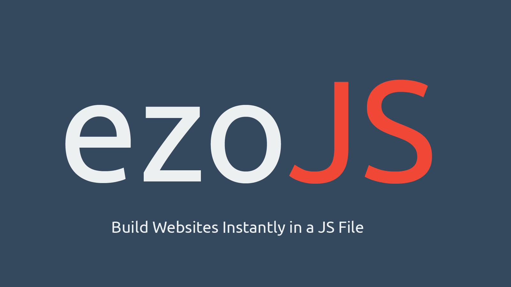

# ezoJS

[](https://gitter.im/najikadri/ezoJS?utm_source=badge&utm_medium=badge&utm_campaign=pr-badge&utm_content=badge)

JavaScript SPA Website Builder from a single JS file

## What is ezoJS
ezoJs  prononouced **(E-Zoo)** is a JavaScript Framework that build websites in a single JS file. ezoJS has global selectors , tools to speed up production and simplify it which means less files and less size and easy to manage projects. Read the document for more information.
### Version
**Alpha** - 0.2.5 [(Changelog)](changelog.md)
##Installation
Git
```
$ git clone https://github.com/najikadri/ezoJS.git
```
Bower
```
$ bower install ezojs
```
## How it works
Read the [introduction](docs/introduction.md) page from the document to check what is ezoJS and how it works
##document
Read  [ezoJS GitBook](http://najikadri.gitbooks.io/ezojs/) from the website.
or read the document from the [summary page](SUMMARY..md) in Github
##Beta Release Features
 The first **beta version** of ezoJS will be released once all features listed below are added.
 
 Read the wiki for more information about the beta verison features.

- [ ] Execute and code php in ezoJS
- [ ] Table creation by eDom
- [ ] Save pages and nodes locally by eData
- [ ] More ezoJS node manipulation and animation
- [ ] eSQL : Store data in local storage like SQL

## Contribute
 Bugs or issues found in ezoJS is in the main ezo.js file under ***@bug*** or ***@issue***.
 
I will be glad if you contributed to this project


