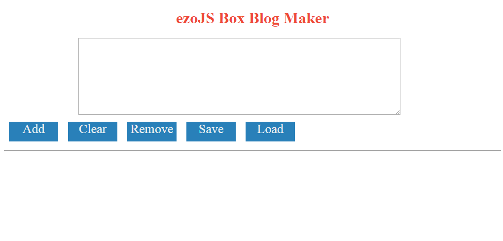
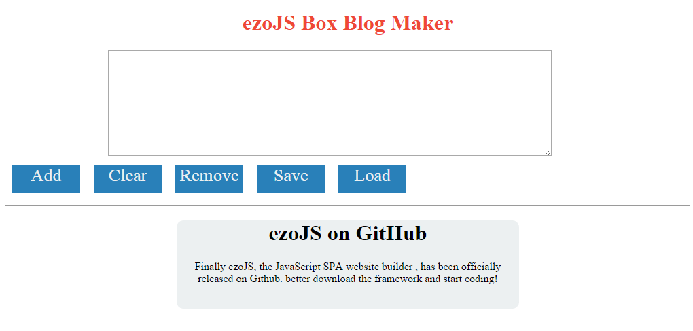

# ezoJS Boxes
ezoJS Boxes is the first demo for ezoJS. ezoJS Boxes is a blog generator. It lets you enter the data in the text area and turn them into a blog post. We will build this website/app step by step


##Description
ezoJS Boxes will need data to manage, create new nodes, remove ones, clear all, save and load data. Our script will be divided into four categories: `//data` , `//stylesheet`,`//pages`, and `//run`.

The website is made up of a title, a text area to enter data, buttons to control the app and below will be the generated blog boxes

**How it works**: When you click add, the app takes the first line as a heading and all other lines as a paragraph

## Step One
The first thing we need to do is to create script.js and index.html
```html
<!DOCTYPE html>
<!-- default template -->
<html>
<head lang="en">
    <meta charset="UTF-8">
    <title>ezoJS Boxes</title>
    <script src="ezo-0.2.6.min.js"></script>
    <script src="script.js"></script>
</head>
<body>

</body>
</html>
```
##Step Two 

Now open your `script.js` file, lets start by adding the data. All we need now is the number of last box created
```javascript
//data
var box = 0;

```
##Step Three
Lets add the stylesheet in ezoJS script. Just create a new variable named styles and add the syntax. We will make buttons from the stylesheet.
```javascript
  box : {
        background_color: eColor.clouds,
        border_radius: px(10),
        margin: eCon.auto,
        margin_bottom: px(10)
    },
    title: {
        text_align: eCon.center,
        color: eColor.flamingo

    },
    button: {
        background_color: eColor.belizeHole,
        width: px(100),
        height: px(40),
        margin: px(10),
        display: eCon.inline_block,
        color: eColor.clouds,
        text_align: eCon.center,
        font_size: px(26),
        cursor: "pointer"
    },
    text : {
        margin_left: "15%",
        margin_right: "15%"
    },
    boxt : {
        text_align: eCon.center
    },
    butt: {
        display: eCon.inline_block
    }
```
##Step Four
Now let's create the main page. We add new function named mainPage and we add the nodes we want. It should be like this:
```javascript
//pages
var mainPage = function () {

};
```
To update the class `"box"` and `"data"` every time it is created , we will set a time interval
```javascript
//pages
var mainPage = function () {
 window.setInterval(function () { //runs every tick
        e$("doc").setCSS(styles.box,"box");
        e$("doc").setCSS(styles.boxt,"data");
    },1);
};
```
##Step Five
Add inside the function the basics of the website like the title, heading, text area, etc..
```javascript
e$("doc").setTitle("ezoJS Boxes");
    // title heading
    e$("doc").addHeading(1,"title");
    e$("title").setCSS(styles.title);
    e$("title").setText("ezoJS Box Blog Maker");
    //text area
    e$("doc").addTextArea("text",10,90);
    e$("text").setCSS(styles.text);
    //button div
    e$("doc").addDiv("buttons");
    e$("buttons").setCSS(styles.butt);
```
##Step Six
Add each button in the website. note clone first button to make a new one and make few changes like ID selection and action.
```javascript
 // add button
    e$("buttons").insert(eDom.div("add"));
    e$("add").setCSS(styles.button);
    e$("add").setText("Add");
    e$("add").setAction(function () {
        box = box + 1;
       e$("container").insert(eDom.div("b"+box));
        var node = e$("b"+box);
        node.addClass("box");
        node.insert(eDom.heading(1,"h"+box));
        var title = e$("text").value.split("\n");
        title = title[0];
        e$("h"+box).setText(title);
        e$("h"+box).addClass("data");
        node.insert(eDom.par("p"+box));
        var par = e$("text").value.split("\n");
        var data = "";
        par[0] = "";
        for (var i = 1; i < par.length;i++) {
            par[i] = par[i]+"\n";
        }
        for (var i = 1; i < par.length;i++) {
            data = data + par[i];
        }
        node.height = px(100+(15*par.length));
        node.setSize("50%",node.height);
        e$("p"+box).setText(data);
        e$("p"+box).addClass("data");
        e$("text").setValue("");

    });
```
```javascript
 // clear button
    e$("buttons").insert(eDom.div("clear"));
    e$("clear").setCSS(styles.button);
    e$("clear").setText("Clear");
    e$("clear").setAction(function () {
        var e = e$("container").children.length;
        for (var i = e-1; i >= 0;i--)
        {
            e$("container").selectChild(i).destroy();
        }
        box = 0;
        e$("text").setValue("");
    });

```
```javascript
 // remove button
    e$("buttons").insert(eDom.div("remove"));
    e$("remove").setCSS(styles.button);
    e$("remove").setText("Remove");
    e$("remove").setAction(function () {
        var index = prompt("Remove which box?",1);
        var i = parseInt(index);
        i = i - 1;
        e$("container").selectChild(i).destroy();
    });
```
```javascript
    //save button
    e$("buttons").insert(eDom.div("save"));
    e$("save").setCSS(styles.button);
    e$("save").setText("Save");
    e$("save").setAction(function () {
       var e = e$("container").children.length;
       var con = e$("container");
       var data = new Object();
        for (var i = 0; i < e;i++) {
            data[con.selectChild(i).getAttr("id")] = {
                num : i,
                id : con.selectChild(i).getAttr("id"),
                title: con.selectChild(i).selectChild(0).innerText,
                par: con.selectChild(i).selectChild(1).innerText,
                height:  con.selectChild(i).height

            }
        }
        console.log(data);
        localStorage.setItem("data",JSON.stringify(data));
        localStorage.setItem("box",box);
    });

```
```javascript
  //load button
    e$("buttons").insert(eDom.div("load"));
    e$("load").setCSS(styles.button);
    e$("load").setText("Load");
    e$("load").setAction(function () {
        box = parseInt(localStorage.getItem("box"));
        var data = JSON.parse(localStorage.getItem("data"));

        for (keys in data) {
            e$("container").insert(eDom.div(data[keys].id));
            var node = e$(data[keys].id);
            node.addClass("box");
            node.insert(eDom.heading(1, "h" + data[keys].num));
            e$("h" + data[keys].num).setText(data[keys].title);
            e$("h" + data[keys].num).addClass("data");
            node.setSize("50%", ( data[keys].height));
            node.insert(eDom.par("p" + data[keys].num));
            e$("p" + data[keys].num).setText(data[keys].par);
            e$("p" + data[keys].num).addClass("data");
        }
    });
```
##Step Seven
Add the last touches to the mainPage
```javascript
// horizontal rule
    e$("doc").horRule();
    //container for boxes
    e$("doc").addDiv("container");
```
##Step Eight
We will now run the website. We will add the page to the page manager and run it
```javascript
//run
$(document).ready(function ( ) {
    eManager.add(mainPage,"index");
    eManager.append("index");
});
```
##Step Nine
Test the website/app , write at the first line your blog post title and then the rest your paragraph. You should see a box like this:

You can make as much blog post as you want and save them to check them later on